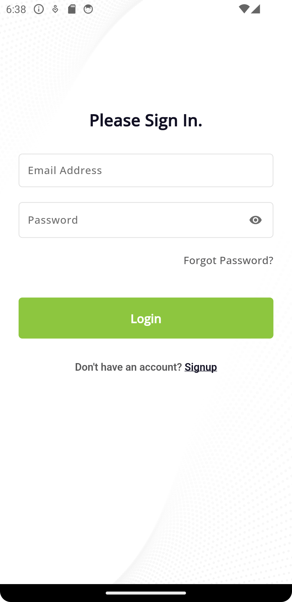

# flutter_architecture

A Flutter project having architecture setup with BLoc.
Contains below features:
 - Login, Signup, Home screen with bottom navigation, Side menu etc modules.
 - API workflow using Dio and Retrofit.
 - Localization
 - Common components used throughout the App
 - CI/CD workflow configuration for GitHub Actions

## App Screenshots of the App

### command generate model classes
flutter pub run build_runner build --delete-conflicting-outputs

